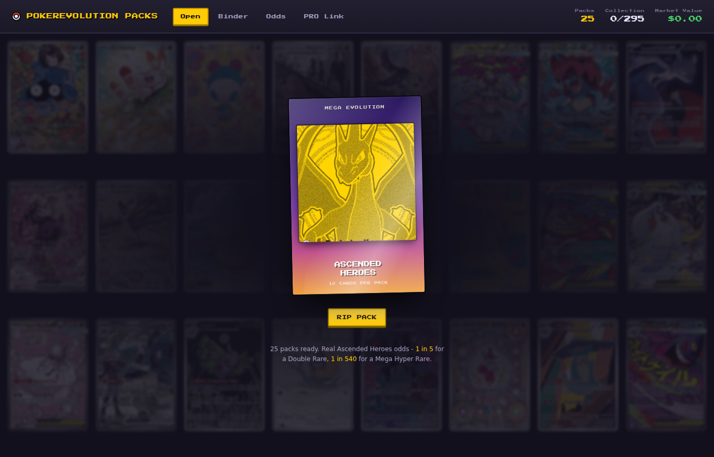
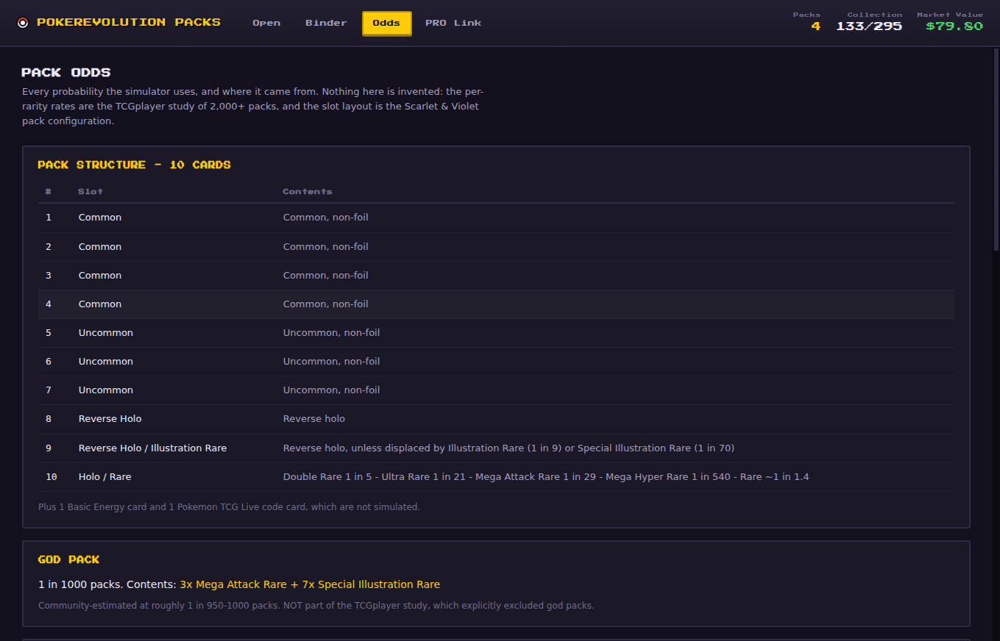
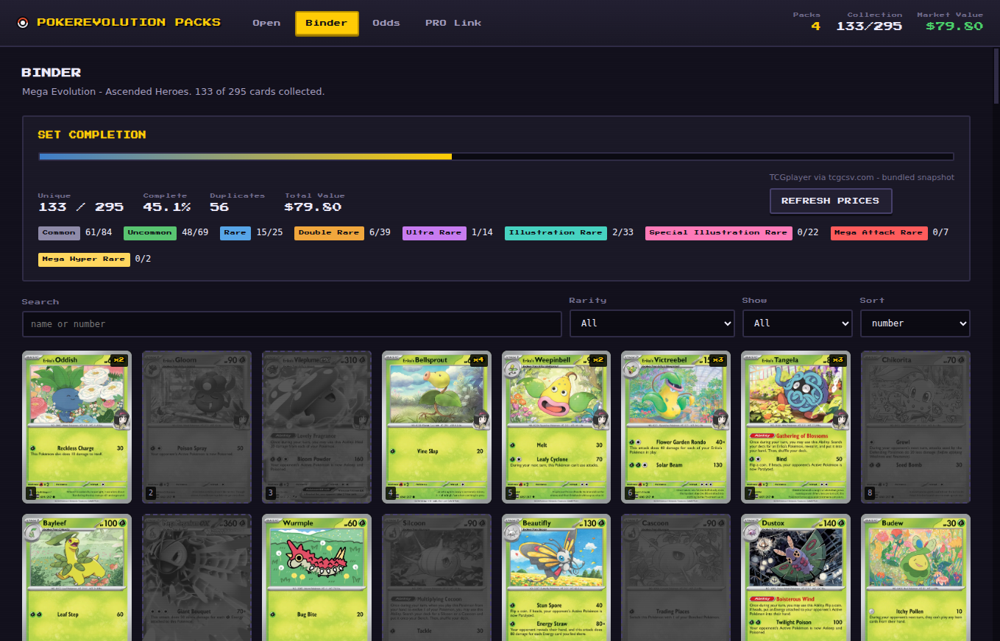

# PokéRevolution Packs

A desktop Pokémon TCG pack simulator for **Mega Evolution — Ascended Heroes**,
built so the packs open with the *real* odds, the cards have real holo foil, and
you earn packs by actually playing Pokémon Revolution Online.



---

## What it does

- **Opens packs with the real pull rates.** Not "roughly like a booster" —
  the actual Scarlet & Violet slot layout and the pull rates TCGplayer measured
  over 2,000+ packs, including god packs. `npm test` opens a million packs and
  checks. [The full derivation is in `docs/PULL-RATES.md`](docs/PULL-RATES.md).
- **Real holographic cards.** Nine distinct foil treatments — reverse holo,
  holo rare, ex, full art, illustration rare, special illustration rare, mega
  attack rare, mega hyper rare — that tilt and shimmer under the cursor.
- **A binder.** All 295 cards, owned ones in colour and the rest greyed out,
  with set completion, duplicate counts and per-printing market values.
- **Market value.** TCGplayer prices for every printing, refreshable in-app.
- **PRO Link.** Watches your Pokémon Revolution Online logs and pays out packs
  as you play.

Everything is bundled — all 295 card images ship inside the app, so it works
with no network connection. Prices refresh online when you ask them to.

## Getting it running

### The easy way

Grab the `.exe` from [the latest release](../../releases/latest), or from the
**Artifacts** of a main, tagged, or manually-triggered
[Build workflow run](../../actions/workflows/build.yml).
Two flavours are produced:

- the file ending in `-x64.exe` — installer, adds a Start Menu entry
- the file ending in `-portable.exe` — single file, run it from anywhere

No install of Node, Python or anything else needed.

### From source

Install [Node.js 22.12 or newer](https://nodejs.org/), then either double-click
`START.bat` on Windows or run:

```bash
npm ci
npm start
```

`START.bat` performs the locked dependency install automatically on its first
run and leaves the error visible if setup or launch fails.

To build the installer yourself:

```bash
npm run dist          # Windows .exe  (run this on Windows)
npm run dist:linux    # Linux AppImage
```

Useful verification commands:

```bash
npm test              # unit, persistence, tracker, and 1,000,000-pack tests
npm run smoke         # graphical UI check; writes screenshots to shots/
npm run pack          # assemble an unpacked app without creating an installer
```

The smoke check opens a real Electron window. On a headless Linux runner, use
`xvfb-run -a npm run smoke`.

## The odds

This was the part worth getting right, so it is documented rather than
asserted. Full working in **[docs/PULL-RATES.md](docs/PULL-RATES.md)**; the
model itself lives in `data/pack-model.me2pt5.json`, where every probability
carries its source.

A pack is 10 cards:

| Slot | Contents |
|---:|---|
| 1–4 | Common |
| 5–7 | Uncommon |
| 8 | Reverse holo |
| 9 | Reverse holo — unless an Illustration Rare (1 in 9) or Special Illustration Rare (1 in 70) displaces it |
| 10 | Holo slot: Double Rare 1 in 5, Ultra Rare 1 in 21, Mega Attack Rare 1 in 29, Mega Hyper Rare 1 in 540, otherwise a Holo Rare |

Plus god packs at roughly 1 in 1,000 — ten hits in one pack, three Mega Attack
Rares and seven Special Illustration Rares.

Running the test suite over a million packs:

```
Double Rare:                1 in 5.0    (published 1 in 5)
Illustration Rare:          1 in 9.0    (published 1 in 9)
Ultra Rare:                 1 in 20.9   (published 1 in 21)
Mega Attack Rare:           1 in 28.8   (published 1 in 29)
Special Illustration Rare:  1 in 69.7   (published 1 in 70)
Mega Hyper Rare:            1 in 535.1  (published 1 in 540)
```

The **Odds** screen shows all of this in-app and can re-run the simulation
live, so you never have to take the numbers on faith.



Two things are genuinely unknown and are labelled as assumptions in the model
file and on the Odds screen: which slot Mega Attack Rares come from (it does not
change any published rate), and the exact god pack rate. Both are one-line edits
in `data/pack-model.me2pt5.json` — no code change.

## PRO Link — earning packs by playing

Pokémon Revolution Online has **no public API for your own progress**. The only
documented API is the server-side map scripting one, and the client stores its
settings in the Windows registry. So the reliable way to see progress from
outside the game is its log output, and that is what this reads.

1. Open **PRO Link** and point it at a folder of logs. PROShine writes one
   plain-text file per day to `PROShine/Logs/<account>-<server>/YYYY-MM-DD.txt`;
   the app offers any such folder it finds on your machine. Any folder of
   `.txt`/`.log` files works.
2. Tick **watch for progress**. New lines are matched against your rules and
   packs land in your wallet as you play.

Rules are plain regular expressions with a pack payout, an "every Nth match"
divisor, a cooldown and a daily cap, so a chatty log cannot flood you. Defaults
cover level-ups, catches, shinies, badges, bosses and quests.

**The exact wording of a log line depends on your client and which Lua script
you run**, so treat the defaults as a starting point. There is a built-in rule
tester: paste real lines from your log and watch which rules light up, then
adjust. Nothing in the tester awards packs.

When you first enable watching, existing log lines are skipped — a month of old
logs will not pay out at once. There is also a manual button for milestones the
log never sees.

## The binder



Cards you own are in colour; the rest are greyed placeholders. Click any card
for a full-size holo view with every printing's market price — this set prints
up to three different reverse-holo patterns per card (standard, Poké Ball, and
Energy Symbol), and the simulator tracks and prices the exact one you pulled.

## How it is put together

```
data/
  pack-model.me2pt5.json   the odds, every number with its source
  cards.me2pt5.json        295 cards: rarities, printings, artists
  prices.json              TCGplayer market prices per printing
src/
  shared/pack-engine.js    the simulation - pure, no dependencies
  main/                    Electron main: persistence, log watcher, prices
  renderer/                the UI, and the ported holo CSS
tools/
  build_data.py            regenerate the card database
  fetch_images.py          download and transcode card art
  port_holo_css.py         port the holo CSS onto this set's rarities
  smoke.js                 drive the real app headless and screenshot it
tests/
  pack-engine.test.js      1,000,000 packs vs the published rates
```

The pack engine is deliberately dependency-free and free of DOM access so the
same code runs in the app and under `node --test`.

To rebuild the data from source:

```bash
npm run build:data     # cards + prices
npm run build:images   # card art (needs Python + Pillow)
```

The tool launcher detects `py`, `python3`, or `python`. If Python is installed
somewhere unusual, set `POKEREV_PYTHON` to its executable path.

## Credits

The holographic card effect is ported from
**[simeydotme/pokemon-cards-css](https://github.com/simeydotme/pokemon-cards-css)**
by Simon Goellner (MIT) — the one that appeared on
[css-tricks](https://css-tricks.com/holographic-trading-card-effect/), and still
the best CSS foil there is. `tools/port_holo_css.py` rewrites its Sword & Shield
era selectors onto this set's rarity ladder, leaving the gradient maths
untouched. Galaxy holo texture by
[aschefield101](https://www.deviantart.com/aschefield101/art/HoloSheet-2012-313543843).

Card data from [PokemonTCG/pokemon-tcg-data](https://github.com/PokemonTCG/pokemon-tcg-data),
card images from [Scrydex](https://scrydex.com), prices from
[tcgcsv.com](https://tcgcsv.com)'s daily TCGplayer mirror. Pull rate research
credited in [docs/PULL-RATES.md](docs/PULL-RATES.md). Interface type is
[Press Start 2P](https://fonts.google.com/specimen/Press+Start+2P) (SIL OFL).

A personal project, not affiliated with Nintendo, Game Freak, The Pokémon
Company or Pokémon Revolution Online. Pokémon and all card images are their
respective owners' property.

The original application source is available under the [MIT License](LICENSE).
Bundled third-party assets and data remain under their respective owners' terms;
see [NOTICE](NOTICE) and the credits above.
